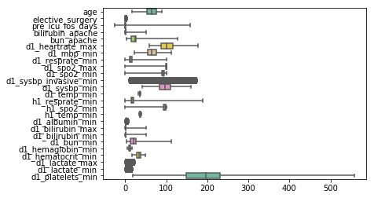
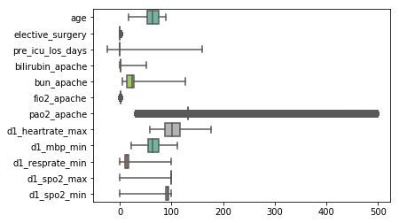
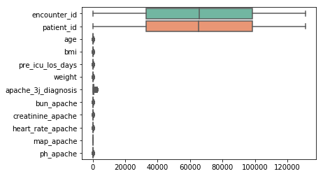
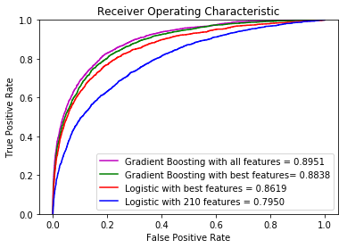
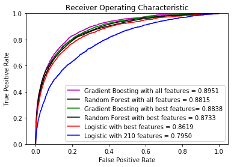
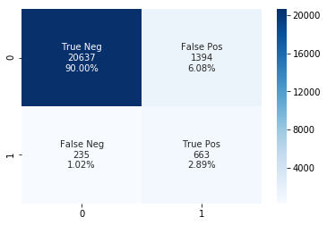

```python
import pandas as pd
import numpy as np
from sklearn import metrics
import matplotlib.pyplot as plt
#import seaborn as sns
%matplotlib inline
import warnings
warnings.filterwarnings('ignore')

train_df = pd.read_csv('desktop/widsdatathon2020/training_v2.csv')
df = pd.read_csv('desktop/widsdatathon2020/unlabeled.csv')
d = pd.read_csv('desktop/widsdatathon2020/WiDS_Datathon_2020_Dictionary.csv')
dummy_df = pd.read_csv('desktop/widsdatathon2020/dummy_df.csv')
dummy_df = dummy_df.reset_index().drop(['index','Unnamed: 0'],axis=1)

```


```python
train_df
```


<div>
<style>
    .dataframe thead tr:only-child th {
        text-align: right;
    }

    .dataframe thead th {
        text-align: left;
    }

    .dataframe tbody tr th {
        vertical-align: top;
    }
</style>
<table border="1" class="dataframe">
  <thead>
    <tr style="text-align: right;">
      <th></th>
      <th>encounter_id</th>
      <th>patient_id</th>
      <th>hospital_id</th>
      <th>hospital_death</th>
      <th>age</th>
      <th>bmi</th>
      <th>elective_surgery</th>
      <th>ethnicity</th>
      <th>gender</th>
      <th>height</th>
      <th>...</th>
      <th>aids</th>
      <th>cirrhosis</th>
      <th>diabetes_mellitus</th>
      <th>hepatic_failure</th>
      <th>immunosuppression</th>
      <th>leukemia</th>
      <th>lymphoma</th>
      <th>solid_tumor_with_metastasis</th>
      <th>apache_3j_bodysystem</th>
      <th>apache_2_bodysystem</th>
    </tr>
  </thead>
  <tbody>
    <tr>
      <th>0</th>
      <td>66154</td>
      <td>25312</td>
      <td>118</td>
      <td>0</td>
      <td>68.0</td>
      <td>22.730000</td>
      <td>0</td>
      <td>Caucasian</td>
      <td>M</td>
      <td>180.3</td>
      <td>...</td>
      <td>0.0</td>
      <td>0.0</td>
      <td>1.0</td>
      <td>0.0</td>
      <td>0.0</td>
      <td>0.0</td>
      <td>0.0</td>
      <td>0.0</td>
      <td>Sepsis</td>
      <td>Cardiovascular</td>
    </tr>
    <tr>
      <th>1</th>
      <td>114252</td>
      <td>59342</td>
      <td>81</td>
      <td>0</td>
      <td>77.0</td>
      <td>27.420000</td>
      <td>0</td>
      <td>Caucasian</td>
      <td>F</td>
      <td>160.0</td>
      <td>...</td>
      <td>0.0</td>
      <td>0.0</td>
      <td>1.0</td>
      <td>0.0</td>
      <td>0.0</td>
      <td>0.0</td>
      <td>0.0</td>
      <td>0.0</td>
      <td>Respiratory</td>
      <td>Respiratory</td>
    </tr>
    <tr>
      <th>2</th>
      <td>119783</td>
      <td>50777</td>
      <td>118</td>
      <td>0</td>
      <td>25.0</td>
      <td>31.950000</td>
      <td>0</td>
      <td>Caucasian</td>
      <td>F</td>
      <td>172.7</td>
      <td>...</td>
      <td>0.0</td>
      <td>0.0</td>
      <td>0.0</td>
      <td>0.0</td>
      <td>0.0</td>
      <td>0.0</td>
      <td>0.0</td>
      <td>0.0</td>
      <td>Metabolic</td>
      <td>Metabolic</td>
    </tr>
    <tr>
      <th>3</th>
      <td>79267</td>
      <td>46918</td>
      <td>118</td>
      <td>0</td>
      <td>81.0</td>
      <td>22.640000</td>
      <td>1</td>
      <td>Caucasian</td>
      <td>F</td>
      <td>165.1</td>
      <td>...</td>
      <td>0.0</td>
      <td>0.0</td>
      <td>0.0</td>
      <td>0.0</td>
      <td>0.0</td>
      <td>0.0</td>
      <td>0.0</td>
      <td>0.0</td>
      <td>Cardiovascular</td>
      <td>Cardiovascular</td>
    </tr>
    <tr>
      <th>4</th>
      <td>92056</td>
      <td>34377</td>
      <td>33</td>
      <td>0</td>
      <td>19.0</td>
      <td>NaN</td>
      <td>0</td>
      <td>Caucasian</td>
      <td>M</td>
      <td>188.0</td>
      <td>...</td>
      <td>0.0</td>
      <td>0.0</td>
      <td>0.0</td>
      <td>0.0</td>
      <td>0.0</td>
      <td>0.0</td>
      <td>0.0</td>
      <td>0.0</td>
      <td>Trauma</td>
      <td>Trauma</td>
    </tr>
    <tr>
      <th>5</th>
      <td>33181</td>
      <td>74489</td>
      <td>83</td>
      <td>0</td>
      <td>67.0</td>
      <td>27.560000</td>
      <td>0</td>
      <td>Caucasian</td>
      <td>M</td>
      <td>190.5</td>
      <td>...</td>
      <td>0.0</td>
      <td>0.0</td>
      <td>1.0</td>
      <td>0.0</td>
      <td>0.0</td>
      <td>0.0</td>
      <td>0.0</td>
      <td>0.0</td>
      <td>Neurological</td>
      <td>Neurologic</td>
    </tr>
    <tr>
      <th>6</th>
      <td>82208</td>
      <td>49526</td>
      <td>83</td>
      <td>0</td>
      <td>59.0</td>
      <td>57.450000</td>
      <td>0</td>
      <td>Caucasian</td>
      <td>F</td>
      <td>165.1</td>
      <td>...</td>
      <td>0.0</td>
      <td>0.0</td>
      <td>1.0</td>
      <td>0.0</td>
      <td>0.0</td>
      <td>0.0</td>
      <td>0.0</td>
      <td>0.0</td>
      <td>Respiratory</td>
      <td>Respiratory</td>
    </tr>
    <tr>
      <th>7</th>
      <td>120995</td>
      <td>50129</td>
      <td>33</td>
      <td>0</td>
      <td>70.0</td>
      <td>NaN</td>
      <td>0</td>
      <td>Caucasian</td>
      <td>M</td>
      <td>165.0</td>
      <td>...</td>
      <td>0.0</td>
      <td>0.0</td>
      <td>0.0</td>
      <td>0.0</td>
      <td>1.0</td>
      <td>0.0</td>
      <td>0.0</td>
      <td>0.0</td>
      <td>Sepsis</td>
      <td>Cardiovascular</td>
    </tr>
    <tr>
      <th>8</th>
      <td>80471</td>
      <td>10577</td>
      <td>118</td>
      <td>1</td>
      <td>45.0</td>
      <td>NaN</td>
      <td>0</td>
      <td>Caucasian</td>
      <td>M</td>
      <td>170.2</td>
      <td>...</td>
      <td>0.0</td>
      <td>0.0</td>
      <td>0.0</td>
      <td>0.0</td>
      <td>0.0</td>
      <td>0.0</td>
      <td>0.0</td>
      <td>0.0</td>
      <td>Cardiovascular</td>
      <td>Cardiovascular</td>
    </tr>
    <tr>
      <th>9</th>
      <td>42871</td>
      <td>90749</td>
      <td>118</td>
      <td>0</td>
      <td>50.0</td>
      <td>25.710000</td>
      <td>0</td>
      <td>NaN</td>
      <td>M</td>
      <td>175.3</td>
      <td>...</td>
      <td>0.0</td>
      <td>0.0</td>
      <td>0.0</td>
      <td>0.0</td>
      <td>0.0</td>
      <td>0.0</td>
      <td>0.0</td>
      <td>0.0</td>
      <td>Cardiovascular</td>
      <td>Cardiovascular</td>
    </tr>
    <tr>
      <th>10</th>
      <td>105427</td>
      <td>125898</td>
      <td>77</td>
      <td>0</td>
      <td>72.0</td>
      <td>28.257052</td>
      <td>1</td>
      <td>Hispanic</td>
      <td>F</td>
      <td>154.9</td>
      <td>...</td>
      <td>0.0</td>
      <td>0.0</td>
      <td>0.0</td>
      <td>0.0</td>
      <td>1.0</td>
      <td>0.0</td>
      <td>0.0</td>
      <td>0.0</td>
      <td>Respiratory</td>
      <td>Respiratory</td>
    </tr>
    <tr>
      <th>11</th>
      <td>91609</td>
      <td>78266</td>
      <td>83</td>
      <td>0</td>
      <td>80.0</td>
      <td>27.382812</td>
      <td>1</td>
      <td>Caucasian</td>
      <td>F</td>
      <td>160.0</td>
      <td>...</td>
      <td>0.0</td>
      <td>0.0</td>
      <td>0.0</td>
      <td>0.0</td>
      <td>0.0</td>
      <td>1.0</td>
      <td>0.0</td>
      <td>0.0</td>
      <td>Neurological</td>
      <td>Neurologic</td>
    </tr>
    <tr>
      <th>12</th>
      <td>76356</td>
      <td>41311</td>
      <td>118</td>
      <td>0</td>
      <td>48.0</td>
      <td>NaN</td>
      <td>0</td>
      <td>Caucasian</td>
      <td>M</td>
      <td>175.3</td>
      <td>...</td>
      <td>0.0</td>
      <td>0.0</td>
      <td>0.0</td>
      <td>0.0</td>
      <td>0.0</td>
      <td>0.0</td>
      <td>0.0</td>
      <td>0.0</td>
      <td>Neurological</td>
      <td>Neurologic</td>
    </tr>
    <tr>
      <th>13</th>
      <td>34030</td>
      <td>103766</td>
      <td>118</td>
      <td>0</td>
      <td>65.0</td>
      <td>NaN</td>
      <td>1</td>
      <td>Caucasian</td>
      <td>M</td>
      <td>172.7</td>
      <td>...</td>
      <td>0.0</td>
      <td>0.0</td>
      <td>0.0</td>
      <td>0.0</td>
      <td>0.0</td>
      <td>0.0</td>
      <td>0.0</td>
      <td>0.0</td>
      <td>Gastrointestinal</td>
      <td>Gastrointestinal</td>
    </tr>
    <tr>
      <th>14</th>
      <td>108388</td>
      <td>98174</td>
      <td>118</td>
      <td>0</td>
      <td>81.0</td>
      <td>38.189067</td>
      <td>1</td>
      <td>Caucasian</td>
      <td>M</td>
      <td>172.7</td>
      <td>...</td>
      <td>0.0</td>
      <td>0.0</td>
      <td>0.0</td>
      <td>0.0</td>
      <td>0.0</td>
      <td>0.0</td>
      <td>0.0</td>
      <td>0.0</td>
      <td>Respiratory</td>
      <td>Respiratory</td>
    </tr>
    <tr>
      <th>15</th>
      <td>120677</td>
      <td>124688</td>
      <td>118</td>
      <td>0</td>
      <td>78.0</td>
      <td>NaN</td>
      <td>0</td>
      <td>Caucasian</td>
      <td>F</td>
      <td>160.0</td>
      <td>...</td>
      <td>0.0</td>
      <td>0.0</td>
      <td>1.0</td>
      <td>0.0</td>
      <td>0.0</td>
      <td>0.0</td>
      <td>0.0</td>
      <td>0.0</td>
      <td>Sepsis</td>
      <td>Cardiovascular</td>
    </tr>
    <tr>
      <th>16</th>
      <td>115771</td>
      <td>71252</td>
      <td>81</td>
      <td>0</td>
      <td>30.0</td>
      <td>23.383178</td>
      <td>0</td>
      <td>Caucasian</td>
      <td>M</td>
      <td>193.0</td>
      <td>...</td>
      <td>0.0</td>
      <td>0.0</td>
      <td>0.0</td>
      <td>0.0</td>
      <td>0.0</td>
      <td>0.0</td>
      <td>0.0</td>
      <td>0.0</td>
      <td>Cardiovascular</td>
      <td>Cardiovascular</td>
    </tr>
    <tr>
      <th>17</th>
      <td>22471</td>
      <td>112115</td>
      <td>118</td>
      <td>0</td>
      <td>46.0</td>
      <td>25.845717</td>
      <td>0</td>
      <td>Hispanic</td>
      <td>M</td>
      <td>167.6</td>
      <td>...</td>
      <td>0.0</td>
      <td>0.0</td>
      <td>0.0</td>
      <td>0.0</td>
      <td>0.0</td>
      <td>0.0</td>
      <td>0.0</td>
      <td>0.0</td>
      <td>Respiratory</td>
      <td>Respiratory</td>
    </tr>
    <tr>
      <th>18</th>
      <td>48056</td>
      <td>114220</td>
      <td>118</td>
      <td>0</td>
      <td>65.0</td>
      <td>28.408929</td>
      <td>0</td>
      <td>Hispanic</td>
      <td>M</td>
      <td>167.6</td>
      <td>...</td>
      <td>0.0</td>
      <td>0.0</td>
      <td>0.0</td>
      <td>0.0</td>
      <td>0.0</td>
      <td>0.0</td>
      <td>0.0</td>
      <td>0.0</td>
      <td>Neurological</td>
      <td>Neurologic</td>
    </tr>
    <tr>
      <th>19</th>
      <td>45954</td>
      <td>102946</td>
      <td>118</td>
      <td>0</td>
      <td>39.0</td>
      <td>37.010278</td>
      <td>1</td>
      <td>NaN</td>
      <td>M</td>
      <td>177.8</td>
      <td>...</td>
      <td>0.0</td>
      <td>0.0</td>
      <td>0.0</td>
      <td>0.0</td>
      <td>0.0</td>
      <td>0.0</td>
      <td>0.0</td>
      <td>0.0</td>
      <td>Cardiovascular</td>
      <td>Cardiovascular</td>
    </tr>
    <tr>
      <th>20</th>
      <td>79115</td>
      <td>88295</td>
      <td>83</td>
      <td>0</td>
      <td>79.0</td>
      <td>28.376100</td>
      <td>1</td>
      <td>Caucasian</td>
      <td>F</td>
      <td>170.2</td>
      <td>...</td>
      <td>0.0</td>
      <td>0.0</td>
      <td>0.0</td>
      <td>0.0</td>
      <td>0.0</td>
      <td>1.0</td>
      <td>0.0</td>
      <td>0.0</td>
      <td>Neurological</td>
      <td>Neurologic</td>
    </tr>
    <tr>
      <th>21</th>
      <td>118620</td>
      <td>59115</td>
      <td>118</td>
      <td>0</td>
      <td>80.0</td>
      <td>35.659989</td>
      <td>0</td>
      <td>Caucasian</td>
      <td>M</td>
      <td>170.2</td>
      <td>...</td>
      <td>0.0</td>
      <td>0.0</td>
      <td>1.0</td>
      <td>0.0</td>
      <td>0.0</td>
      <td>0.0</td>
      <td>0.0</td>
      <td>0.0</td>
      <td>Sepsis</td>
      <td>Cardiovascular</td>
    </tr>
    <tr>
      <th>22</th>
      <td>21050</td>
      <td>31257</td>
      <td>81</td>
      <td>0</td>
      <td>58.0</td>
      <td>NaN</td>
      <td>1</td>
      <td>Caucasian</td>
      <td>F</td>
      <td>162.6</td>
      <td>...</td>
      <td>0.0</td>
      <td>0.0</td>
      <td>0.0</td>
      <td>0.0</td>
      <td>0.0</td>
      <td>0.0</td>
      <td>0.0</td>
      <td>0.0</td>
      <td>Genitourinary</td>
      <td>Renal/Genitourinary</td>
    </tr>
    <tr>
      <th>23</th>
      <td>95460</td>
      <td>120539</td>
      <td>118</td>
      <td>0</td>
      <td>87.0</td>
      <td>21.963763</td>
      <td>0</td>
      <td>Caucasian</td>
      <td>M</td>
      <td>180.3</td>
      <td>...</td>
      <td>0.0</td>
      <td>0.0</td>
      <td>0.0</td>
      <td>0.0</td>
      <td>0.0</td>
      <td>0.0</td>
      <td>0.0</td>
      <td>0.0</td>
      <td>Sepsis</td>
      <td>Cardiovascular</td>
    </tr>
    <tr>
      <th>24</th>
      <td>7220</td>
      <td>92453</td>
      <td>77</td>
      <td>0</td>
      <td>60.0</td>
      <td>29.509959</td>
      <td>0</td>
      <td>Caucasian</td>
      <td>M</td>
      <td>188.0</td>
      <td>...</td>
      <td>0.0</td>
      <td>0.0</td>
      <td>0.0</td>
      <td>0.0</td>
      <td>0.0</td>
      <td>0.0</td>
      <td>0.0</td>
      <td>0.0</td>
      <td>Cardiovascular</td>
      <td>Cardiovascular</td>
    </tr>
    <tr>
      <th>25</th>
      <td>29208</td>
      <td>114628</td>
      <td>118</td>
      <td>1</td>
      <td>68.0</td>
      <td>26.010703</td>
      <td>0</td>
      <td>Caucasian</td>
      <td>F</td>
      <td>165.1</td>
      <td>...</td>
      <td>0.0</td>
      <td>0.0</td>
      <td>0.0</td>
      <td>0.0</td>
      <td>0.0</td>
      <td>0.0</td>
      <td>0.0</td>
      <td>0.0</td>
      <td>Sepsis</td>
      <td>Cardiovascular</td>
    </tr>
    <tr>
      <th>26</th>
      <td>32902</td>
      <td>17922</td>
      <td>118</td>
      <td>0</td>
      <td>85.0</td>
      <td>23.809770</td>
      <td>0</td>
      <td>Caucasian</td>
      <td>F</td>
      <td>152.4</td>
      <td>...</td>
      <td>0.0</td>
      <td>0.0</td>
      <td>0.0</td>
      <td>0.0</td>
      <td>0.0</td>
      <td>0.0</td>
      <td>0.0</td>
      <td>0.0</td>
      <td>Gastrointestinal</td>
      <td>Gastrointestinal</td>
    </tr>
    <tr>
      <th>27</th>
      <td>16847</td>
      <td>8036</td>
      <td>33</td>
      <td>0</td>
      <td>79.0</td>
      <td>23.408979</td>
      <td>0</td>
      <td>Caucasian</td>
      <td>F</td>
      <td>149.9</td>
      <td>...</td>
      <td>0.0</td>
      <td>0.0</td>
      <td>0.0</td>
      <td>0.0</td>
      <td>0.0</td>
      <td>0.0</td>
      <td>0.0</td>
      <td>0.0</td>
      <td>Cardiovascular</td>
      <td>Cardiovascular</td>
    </tr>
    <tr>
      <th>28</th>
      <td>46026</td>
      <td>71020</td>
      <td>118</td>
      <td>0</td>
      <td>NaN</td>
      <td>NaN</td>
      <td>1</td>
      <td>Caucasian</td>
      <td>F</td>
      <td>160.0</td>
      <td>...</td>
      <td>0.0</td>
      <td>0.0</td>
      <td>1.0</td>
      <td>0.0</td>
      <td>0.0</td>
      <td>0.0</td>
      <td>0.0</td>
      <td>0.0</td>
      <td>Trauma</td>
      <td>Trauma</td>
    </tr>
    <tr>
      <th>29</th>
      <td>6777</td>
      <td>83373</td>
      <td>118</td>
      <td>0</td>
      <td>60.0</td>
      <td>26.485715</td>
      <td>0</td>
      <td>African American</td>
      <td>M</td>
      <td>180.3</td>
      <td>...</td>
      <td>0.0</td>
      <td>0.0</td>
      <td>0.0</td>
      <td>0.0</td>
      <td>0.0</td>
      <td>0.0</td>
      <td>0.0</td>
      <td>0.0</td>
      <td>Cardiovascular</td>
      <td>Cardiovascular</td>
    </tr>
    <tr>
      <th>...</th>
      <td>...</td>
      <td>...</td>
      <td>...</td>
      <td>...</td>
      <td>...</td>
      <td>...</td>
      <td>...</td>
      <td>...</td>
      <td>...</td>
      <td>...</td>
      <td>...</td>
      <td>...</td>
      <td>...</td>
      <td>...</td>
      <td>...</td>
      <td>...</td>
      <td>...</td>
      <td>...</td>
      <td>...</td>
      <td>...</td>
      <td>...</td>
    </tr>
    <tr>
      <th>91683</th>
      <td>106800</td>
      <td>98661</td>
      <td>6</td>
      <td>0</td>
      <td>75.0</td>
      <td>41.240169</td>
      <td>0</td>
      <td>Caucasian</td>
      <td>F</td>
      <td>172.7</td>
      <td>...</td>
      <td>0.0</td>
      <td>0.0</td>
      <td>0.0</td>
      <td>0.0</td>
      <td>0.0</td>
      <td>0.0</td>
      <td>0.0</td>
      <td>0.0</td>
      <td>Cardiovascular</td>
      <td>Cardiovascular</td>
    </tr>
    <tr>
      <th>91684</th>
      <td>93704</td>
      <td>90014</td>
      <td>121</td>
      <td>0</td>
      <td>19.0</td>
      <td>21.849332</td>
      <td>0</td>
      <td>Asian</td>
      <td>F</td>
      <td>157.5</td>
      <td>...</td>
      <td>0.0</td>
      <td>0.0</td>
      <td>0.0</td>
      <td>0.0</td>
      <td>0.0</td>
      <td>0.0</td>
      <td>0.0</td>
      <td>0.0</td>
      <td>Metabolic</td>
      <td>Metabolic</td>
    </tr>
    <tr>
      <th>91685</th>
      <td>27176</td>
      <td>34169</td>
      <td>184</td>
      <td>0</td>
      <td>58.0</td>
      <td>25.360019</td>
      <td>0</td>
      <td>Caucasian</td>
      <td>F</td>
      <td>173.0</td>
      <td>...</td>
      <td>0.0</td>
      <td>0.0</td>
      <td>0.0</td>
      <td>0.0</td>
      <td>0.0</td>
      <td>0.0</td>
      <td>0.0</td>
      <td>0.0</td>
      <td>Cardiovascular</td>
      <td>Cardiovascular</td>
    </tr>
    <tr>
      <th>91686</th>
      <td>13520</td>
      <td>96615</td>
      <td>184</td>
      <td>0</td>
      <td>86.0</td>
      <td>31.157451</td>
      <td>0</td>
      <td>Caucasian</td>
      <td>F</td>
      <td>157.0</td>
      <td>...</td>
      <td>0.0</td>
      <td>0.0</td>
      <td>0.0</td>
      <td>0.0</td>
      <td>0.0</td>
      <td>0.0</td>
      <td>0.0</td>
      <td>0.0</td>
      <td>Sepsis</td>
      <td>Cardiovascular</td>
    </tr>
    <tr>
      <th>91687</th>
      <td>76490</td>
      <td>85324</td>
      <td>195</td>
      <td>0</td>
      <td>71.0</td>
      <td>32.690378</td>
      <td>0</td>
      <td>Caucasian</td>
      <td>M</td>
      <td>172.7</td>
      <td>...</td>
      <td>0.0</td>
      <td>0.0</td>
      <td>0.0</td>
      <td>0.0</td>
      <td>0.0</td>
      <td>0.0</td>
      <td>0.0</td>
      <td>0.0</td>
      <td>Neurological</td>
      <td>Neurologic</td>
    </tr>
    <tr>
      <th>91688</th>
      <td>24687</td>
      <td>1613</td>
      <td>195</td>
      <td>0</td>
      <td>49.0</td>
      <td>31.866165</td>
      <td>0</td>
      <td>Caucasian</td>
      <td>M</td>
      <td>182.9</td>
      <td>...</td>
      <td>0.0</td>
      <td>0.0</td>
      <td>1.0</td>
      <td>0.0</td>
      <td>0.0</td>
      <td>0.0</td>
      <td>0.0</td>
      <td>0.0</td>
      <td>Sepsis</td>
      <td>Cardiovascular</td>
    </tr>
    <tr>
      <th>91689</th>
      <td>47573</td>
      <td>27439</td>
      <td>6</td>
      <td>0</td>
      <td>NaN</td>
      <td>24.445450</td>
      <td>0</td>
      <td>Caucasian</td>
      <td>M</td>
      <td>188.0</td>
      <td>...</td>
      <td>NaN</td>
      <td>NaN</td>
      <td>NaN</td>
      <td>NaN</td>
      <td>NaN</td>
      <td>NaN</td>
      <td>NaN</td>
      <td>NaN</td>
      <td>NaN</td>
      <td>NaN</td>
    </tr>
    <tr>
      <th>91690</th>
      <td>15896</td>
      <td>46682</td>
      <td>195</td>
      <td>0</td>
      <td>83.0</td>
      <td>26.760649</td>
      <td>0</td>
      <td>Caucasian</td>
      <td>F</td>
      <td>163.8</td>
      <td>...</td>
      <td>0.0</td>
      <td>0.0</td>
      <td>0.0</td>
      <td>0.0</td>
      <td>0.0</td>
      <td>0.0</td>
      <td>0.0</td>
      <td>0.0</td>
      <td>Cardiovascular</td>
      <td>Cardiovascular</td>
    </tr>
    <tr>
      <th>91691</th>
      <td>96280</td>
      <td>27717</td>
      <td>184</td>
      <td>1</td>
      <td>59.0</td>
      <td>29.384757</td>
      <td>0</td>
      <td>Caucasian</td>
      <td>F</td>
      <td>165.0</td>
      <td>...</td>
      <td>0.0</td>
      <td>0.0</td>
      <td>0.0</td>
      <td>0.0</td>
      <td>0.0</td>
      <td>0.0</td>
      <td>0.0</td>
      <td>0.0</td>
      <td>Cardiovascular</td>
      <td>Cardiovascular</td>
    </tr>
    <tr>
      <th>91692</th>
      <td>125145</td>
      <td>56872</td>
      <td>30</td>
      <td>0</td>
      <td>36.0</td>
      <td>20.575852</td>
      <td>0</td>
      <td>Caucasian</td>
      <td>F</td>
      <td>162.6</td>
      <td>...</td>
      <td>0.0</td>
      <td>0.0</td>
      <td>1.0</td>
      <td>0.0</td>
      <td>0.0</td>
      <td>0.0</td>
      <td>0.0</td>
      <td>0.0</td>
      <td>Metabolic</td>
      <td>Metabolic</td>
    </tr>
    <tr>
      <th>91693</th>
      <td>57002</td>
      <td>57515</td>
      <td>183</td>
      <td>0</td>
      <td>NaN</td>
      <td>18.526701</td>
      <td>0</td>
      <td>Caucasian</td>
      <td>M</td>
      <td>178.0</td>
      <td>...</td>
      <td>NaN</td>
      <td>NaN</td>
      <td>NaN</td>
      <td>NaN</td>
      <td>NaN</td>
      <td>NaN</td>
      <td>NaN</td>
      <td>NaN</td>
      <td>NaN</td>
      <td>NaN</td>
    </tr>
    <tr>
      <th>91694</th>
      <td>54174</td>
      <td>38625</td>
      <td>30</td>
      <td>0</td>
      <td>58.0</td>
      <td>33.211359</td>
      <td>0</td>
      <td>Caucasian</td>
      <td>M</td>
      <td>182.9</td>
      <td>...</td>
      <td>0.0</td>
      <td>0.0</td>
      <td>1.0</td>
      <td>0.0</td>
      <td>0.0</td>
      <td>0.0</td>
      <td>0.0</td>
      <td>0.0</td>
      <td>Cardiovascular</td>
      <td>Cardiovascular</td>
    </tr>
    <tr>
      <th>91695</th>
      <td>41182</td>
      <td>88364</td>
      <td>30</td>
      <td>0</td>
      <td>49.0</td>
      <td>21.748106</td>
      <td>0</td>
      <td>Caucasian</td>
      <td>F</td>
      <td>170.2</td>
      <td>...</td>
      <td>0.0</td>
      <td>0.0</td>
      <td>0.0</td>
      <td>0.0</td>
      <td>0.0</td>
      <td>0.0</td>
      <td>0.0</td>
      <td>0.0</td>
      <td>Neurological</td>
      <td>Neurologic</td>
    </tr>
    <tr>
      <th>91696</th>
      <td>18985</td>
      <td>20726</td>
      <td>30</td>
      <td>1</td>
      <td>65.0</td>
      <td>NaN</td>
      <td>0</td>
      <td>Caucasian</td>
      <td>M</td>
      <td>NaN</td>
      <td>...</td>
      <td>0.0</td>
      <td>0.0</td>
      <td>0.0</td>
      <td>0.0</td>
      <td>0.0</td>
      <td>0.0</td>
      <td>0.0</td>
      <td>0.0</td>
      <td>Sepsis</td>
      <td>Cardiovascular</td>
    </tr>
    <tr>
      <th>91697</th>
      <td>128303</td>
      <td>51968</td>
      <td>195</td>
      <td>0</td>
      <td>33.0</td>
      <td>24.488889</td>
      <td>0</td>
      <td>Caucasian</td>
      <td>F</td>
      <td>150.0</td>
      <td>...</td>
      <td>0.0</td>
      <td>0.0</td>
      <td>0.0</td>
      <td>0.0</td>
      <td>0.0</td>
      <td>0.0</td>
      <td>0.0</td>
      <td>0.0</td>
      <td>Sepsis</td>
      <td>Cardiovascular</td>
    </tr>
    <tr>
      <th>91698</th>
      <td>83806</td>
      <td>68549</td>
      <td>195</td>
      <td>0</td>
      <td>47.0</td>
      <td>51.439842</td>
      <td>1</td>
      <td>Caucasian</td>
      <td>M</td>
      <td>195.0</td>
      <td>...</td>
      <td>0.0</td>
      <td>0.0</td>
      <td>0.0</td>
      <td>0.0</td>
      <td>0.0</td>
      <td>0.0</td>
      <td>0.0</td>
      <td>0.0</td>
      <td>Gastrointestinal</td>
      <td>Gastrointestinal</td>
    </tr>
    <tr>
      <th>91699</th>
      <td>79858</td>
      <td>57121</td>
      <td>30</td>
      <td>0</td>
      <td>57.0</td>
      <td>33.810548</td>
      <td>0</td>
      <td>African American</td>
      <td>M</td>
      <td>188.0</td>
      <td>...</td>
      <td>0.0</td>
      <td>0.0</td>
      <td>0.0</td>
      <td>0.0</td>
      <td>0.0</td>
      <td>0.0</td>
      <td>0.0</td>
      <td>0.0</td>
      <td>Cardiovascular</td>
      <td>Cardiovascular</td>
    </tr>
    <tr>
      <th>91700</th>
      <td>103983</td>
      <td>25454</td>
      <td>30</td>
      <td>0</td>
      <td>85.0</td>
      <td>25.091529</td>
      <td>0</td>
      <td>Caucasian</td>
      <td>M</td>
      <td>178.0</td>
      <td>...</td>
      <td>0.0</td>
      <td>0.0</td>
      <td>0.0</td>
      <td>0.0</td>
      <td>0.0</td>
      <td>0.0</td>
      <td>0.0</td>
      <td>0.0</td>
      <td>Gastrointestinal</td>
      <td>Gastrointestinal</td>
    </tr>
    <tr>
      <th>91701</th>
      <td>118430</td>
      <td>83320</td>
      <td>6</td>
      <td>0</td>
      <td>21.0</td>
      <td>24.874059</td>
      <td>0</td>
      <td>Caucasian</td>
      <td>M</td>
      <td>185.4</td>
      <td>...</td>
      <td>0.0</td>
      <td>0.0</td>
      <td>1.0</td>
      <td>0.0</td>
      <td>0.0</td>
      <td>0.0</td>
      <td>0.0</td>
      <td>0.0</td>
      <td>Metabolic</td>
      <td>Metabolic</td>
    </tr>
    <tr>
      <th>91702</th>
      <td>1216</td>
      <td>97004</td>
      <td>30</td>
      <td>0</td>
      <td>18.0</td>
      <td>20.284799</td>
      <td>0</td>
      <td>Caucasian</td>
      <td>M</td>
      <td>172.7</td>
      <td>...</td>
      <td>0.0</td>
      <td>0.0</td>
      <td>0.0</td>
      <td>0.0</td>
      <td>0.0</td>
      <td>0.0</td>
      <td>0.0</td>
      <td>0.0</td>
      <td>Metabolic</td>
      <td>Metabolic</td>
    </tr>
    <tr>
      <th>91703</th>
      <td>65539</td>
      <td>128056</td>
      <td>30</td>
      <td>0</td>
      <td>53.0</td>
      <td>45.935203</td>
      <td>0</td>
      <td>Caucasian</td>
      <td>M</td>
      <td>190.5</td>
      <td>...</td>
      <td>0.0</td>
      <td>0.0</td>
      <td>1.0</td>
      <td>0.0</td>
      <td>0.0</td>
      <td>0.0</td>
      <td>0.0</td>
      <td>0.0</td>
      <td>Sepsis</td>
      <td>Cardiovascular</td>
    </tr>
    <tr>
      <th>91704</th>
      <td>96325</td>
      <td>77671</td>
      <td>30</td>
      <td>0</td>
      <td>38.0</td>
      <td>32.992923</td>
      <td>0</td>
      <td>Caucasian</td>
      <td>M</td>
      <td>177.8</td>
      <td>...</td>
      <td>0.0</td>
      <td>0.0</td>
      <td>0.0</td>
      <td>0.0</td>
      <td>0.0</td>
      <td>0.0</td>
      <td>0.0</td>
      <td>0.0</td>
      <td>Metabolic</td>
      <td>Metabolic</td>
    </tr>
    <tr>
      <th>91705</th>
      <td>111411</td>
      <td>7848</td>
      <td>195</td>
      <td>0</td>
      <td>67.0</td>
      <td>28.876843</td>
      <td>0</td>
      <td>African American</td>
      <td>M</td>
      <td>182.9</td>
      <td>...</td>
      <td>0.0</td>
      <td>0.0</td>
      <td>1.0</td>
      <td>0.0</td>
      <td>0.0</td>
      <td>0.0</td>
      <td>0.0</td>
      <td>0.0</td>
      <td>Metabolic</td>
      <td>Metabolic</td>
    </tr>
    <tr>
      <th>91706</th>
      <td>127138</td>
      <td>59223</td>
      <td>121</td>
      <td>0</td>
      <td>54.0</td>
      <td>19.770448</td>
      <td>0</td>
      <td>Native American</td>
      <td>M</td>
      <td>177.8</td>
      <td>...</td>
      <td>0.0</td>
      <td>0.0</td>
      <td>0.0</td>
      <td>0.0</td>
      <td>0.0</td>
      <td>0.0</td>
      <td>0.0</td>
      <td>0.0</td>
      <td>Cardiovascular</td>
      <td>Cardiovascular</td>
    </tr>
    <tr>
      <th>91707</th>
      <td>276</td>
      <td>34638</td>
      <td>183</td>
      <td>0</td>
      <td>NaN</td>
      <td>33.933518</td>
      <td>0</td>
      <td>Caucasian</td>
      <td>F</td>
      <td>152.0</td>
      <td>...</td>
      <td>NaN</td>
      <td>NaN</td>
      <td>NaN</td>
      <td>NaN</td>
      <td>NaN</td>
      <td>NaN</td>
      <td>NaN</td>
      <td>NaN</td>
      <td>NaN</td>
      <td>NaN</td>
    </tr>
    <tr>
      <th>91708</th>
      <td>91592</td>
      <td>78108</td>
      <td>30</td>
      <td>0</td>
      <td>75.0</td>
      <td>23.060250</td>
      <td>0</td>
      <td>Caucasian</td>
      <td>M</td>
      <td>177.8</td>
      <td>...</td>
      <td>0.0</td>
      <td>0.0</td>
      <td>1.0</td>
      <td>0.0</td>
      <td>0.0</td>
      <td>0.0</td>
      <td>0.0</td>
      <td>1.0</td>
      <td>Sepsis</td>
      <td>Cardiovascular</td>
    </tr>
    <tr>
      <th>91709</th>
      <td>66119</td>
      <td>13486</td>
      <td>121</td>
      <td>0</td>
      <td>56.0</td>
      <td>47.179671</td>
      <td>0</td>
      <td>Caucasian</td>
      <td>F</td>
      <td>183.0</td>
      <td>...</td>
      <td>0.0</td>
      <td>0.0</td>
      <td>0.0</td>
      <td>0.0</td>
      <td>0.0</td>
      <td>0.0</td>
      <td>0.0</td>
      <td>0.0</td>
      <td>Sepsis</td>
      <td>Cardiovascular</td>
    </tr>
    <tr>
      <th>91710</th>
      <td>8981</td>
      <td>58179</td>
      <td>195</td>
      <td>0</td>
      <td>48.0</td>
      <td>27.236914</td>
      <td>0</td>
      <td>Caucasian</td>
      <td>M</td>
      <td>170.2</td>
      <td>...</td>
      <td>0.0</td>
      <td>0.0</td>
      <td>1.0</td>
      <td>0.0</td>
      <td>0.0</td>
      <td>0.0</td>
      <td>0.0</td>
      <td>0.0</td>
      <td>Metabolic</td>
      <td>Metabolic</td>
    </tr>
    <tr>
      <th>91711</th>
      <td>33776</td>
      <td>120598</td>
      <td>66</td>
      <td>0</td>
      <td>NaN</td>
      <td>23.297481</td>
      <td>0</td>
      <td>Caucasian</td>
      <td>F</td>
      <td>154.9</td>
      <td>...</td>
      <td>0.0</td>
      <td>0.0</td>
      <td>0.0</td>
      <td>0.0</td>
      <td>0.0</td>
      <td>0.0</td>
      <td>0.0</td>
      <td>0.0</td>
      <td>Respiratory</td>
      <td>Respiratory</td>
    </tr>
    <tr>
      <th>91712</th>
      <td>1671</td>
      <td>53612</td>
      <td>104</td>
      <td>0</td>
      <td>82.0</td>
      <td>22.031250</td>
      <td>1</td>
      <td>Caucasian</td>
      <td>F</td>
      <td>160.0</td>
      <td>...</td>
      <td>0.0</td>
      <td>0.0</td>
      <td>0.0</td>
      <td>0.0</td>
      <td>0.0</td>
      <td>0.0</td>
      <td>0.0</td>
      <td>0.0</td>
      <td>Gastrointestinal</td>
      <td>Gastrointestinal</td>
    </tr>
  </tbody>
</table>
<p>91713 rows × 186 columns</p>
</div>


```python
from sklearn.model_selection import train_test_split
X = dummy_df.drop('hospital_death',axis=1)
y = dummy_df['hospital_death']

X_train, X_test, y_train, y_test = train_test_split(X, y, random_state=0)
```


```python
feature_name = X.columns.tolist()
```


```python

def cor_selector(X, y,num_feats):
    cor_list = []
    # calculate the correlation with y for each feature
    for i in X.columns.tolist():
        cor = np.corrcoef(X[i], y)[0, 1]
        cor_list.append(cor)
    # replace NaN with 0
    cor_list = [0 if np.isnan(i) else i for i in cor_list]
    # feature name
    cor_feature = X.iloc[:,np.argsort(np.abs(cor_list))[-num_feats:]].columns.tolist()
    # feature selection? 0 for not select, 1 for select
    cor_support = [True if i in cor_feature else False for i in feature_name]
    return cor_support, cor_feature
cor_support, cor_feature = cor_selector(X_train, y_train,num_feats=50)
print(cor_feature)
```

    ['d1_calcium_min', 'h1_diasbp_min', 'h1_inr_min', 'd1_inr_min', 'h1_diasbp_noninvasive_min', 'd1_wbc_max', 'd1_mbp_invasive_min', 'h1_lactate_max', 'd1_albumin_max', 'ph_apache', 'h1_lactate_min', 'fio2_apache', 'd1_sysbp_invasive_min', 'h1_mbp_min', 'albumin_apache', 'd1_inr_max', 'h1_inr_max', 'h1_mbp_noninvasive_min', 'h1_sysbp_min', 'h1_sysbp_noninvasive_min', 'temp_apache', 'd1_albumin_min', 'd1_hco3_min', 'd1_heartrate_max', 'bun_apache', 'intubated_apache_0.0', 'intubated_apache_1.0', 'd1_bun_min', 'd1_arterial_ph_min', 'd1_bun_max', 'd1_diasbp_noninvasive_min', 'd1_diasbp_min', 'gcs_eyes_apache_4', 'd1_mbp_noninvasive_min', 'd1_mbp_min', 'd1_temp_min', 'gcs_verbal_apache_5', 'd1_spo2_min', 'd1_sysbp_noninvasive_min', 'd1_sysbp_min', 'gcs_verbal_apache_1', 'ventilated_apache_1.0', 'ventilated_apache_0.0', 'gcs_motor_apache_6', 'gcs_motor_apache_1', 'gcs_eyes_apache_1', 'd1_lactate_max', 'apache_4a_icu_death_prob', 'd1_lactate_min', 'apache_4a_hospital_death_prob']


```python
# import seaborn as sns

# corr =dummy_df[['d1_calcium_min', 'h1_diasbp_min', 'h1_inr_min', 'd1_inr_min', 'h1_diasbp_noninvasive_min', 'd1_wbc_max', 'd1_mbp_invasive_min', 'h1_lactate_max', 'd1_albumin_max', 'ph_apache', 'h1_lactate_min', 'fio2_apache', 'd1_sysbp_invasive_min', 'h1_mbp_min', 'albumin_apache', 'd1_inr_max', 'h1_inr_max', 'h1_mbp_noninvasive_min', 'h1_sysbp_min', 'h1_sysbp_noninvasive_min', 'temp_apache', 'd1_albumin_min', 'd1_hco3_min', 'd1_heartrate_max', 'bun_apache', 'intubated_apache_0.0', 'intubated_apache_1.0', 'd1_bun_min', 'd1_arterial_ph_min', 'd1_bun_max', 'd1_diasbp_noninvasive_min', 'd1_diasbp_min', 'gcs_eyes_apache_4', 'd1_mbp_noninvasive_min', 'd1_mbp_min', 'd1_temp_min', 'gcs_verbal_apache_5', 'd1_spo2_min', 'd1_sysbp_noninvasive_min', 'd1_sysbp_min', 'gcs_verbal_apache_1', 'ventilated_apache_1.0', 'ventilated_apache_0.0', 'gcs_motor_apache_6', 'gcs_motor_apache_1', 'gcs_eyes_apache_1', 'd1_lactate_max', 'apache_4a_icu_death_prob', 'd1_lactate_min', 'apache_4a_hospital_death_prob']]
# mask = np.triu(np.ones_like(corr, dtype=np.bool))

# # Set up the matplotlib figure
# f, ax = plt.subplots(figsize=(11, 9))

# # Generate a custom diverging colormap
# cmap = sns.diverging_palette(220, 10, as_cmap=True)

# # Draw the heatmap with the mask and correct aspect ratio
# sns.heatmap(corr, mask=mask, cmap=cmap, vmax=.3, center=0,
#             square=True, linewidths=.5, cbar_kws={"shrink": .5})
```


```python
ax1 = sns.boxplot(data=dummy_df[f_classif_feature].drop(['temp_apache','d1_albumin_min','d1_lactate_max','d1_lactate_min','apache_4a_hospital_death_prob','apache_4a_icu_death_prob','d1_arterial_ph_min','d1_temp_min'],axis=1), orient="h", palette="Set2",whis=100000000)
```


```python
#categorical to Categorical outcome
from sklearn.feature_selection import SelectKBest
from sklearn.feature_selection import chi2
from sklearn.preprocessing import MinMaxScaler
X_norm = MinMaxScaler().fit_transform(X)
chi_selector = SelectKBest(chi2, k=50)
chi_selector.fit(X_norm, y)
chi_support = chi_selector.get_support()
chi_feature = X.loc[:,chi_support].columns.tolist()
print(str(len(chi_feature)), 'selected features')
```

    50 selected features


```python
print(chi_feature)
```

    ['elective_surgery', 'apache_2_diagnosis', 'apache_post_operative', 'bun_apache', 'd1_diasbp_min', 'd1_diasbp_noninvasive_min', 'd1_heartrate_max', 'd1_mbp_min', 'd1_mbp_noninvasive_min', 'd1_sysbp_min', 'd1_sysbp_noninvasive_min', 'h1_sysbp_min', 'd1_bun_max', 'd1_bun_min', 'd1_creatinine_max', 'd1_lactate_max', 'd1_lactate_min', 'apache_4a_hospital_death_prob', 'apache_4a_icu_death_prob', 'gcs_eyes_apache_0', 'gcs_eyes_apache_1', 'gcs_eyes_apache_2', 'gcs_eyes_apache_4', 'gcs_motor_apache_0', 'gcs_motor_apache_1', 'gcs_motor_apache_2', 'gcs_motor_apache_3', 'gcs_motor_apache_4', 'gcs_motor_apache_5', 'gcs_motor_apache_6', 'gcs_verbal_apache_0', 'gcs_verbal_apache_1', 'gcs_verbal_apache_5', 'gcs_unable_apache_1.0', 'intubated_apache_0.0', 'intubated_apache_1.0', 'ventilated_apache_0.0', 'ventilated_apache_1.0', 'immunosuppression_1.0', 'solid_tumor_with_metastasis_1.0', 'hospital_admit_source_Floor', 'hospital_admit_source_Operating Room', 'hospital_admit_source_Step-Down Unit (SDU)', 'icu_admit_source_Floor', 'icu_admit_source_Operating Room / Recovery', 'apache_3j_bodysystem_Metabolic', 'apache_3j_bodysystem_Sepsis', 'apache_2_bodysystem_Cardiovascular', 'apache_2_bodysystem_Metabolic', 'apache_2_bodysystem_Undefined diagnoses']


```python
num_feats=50

from sklearn.feature_selection import RFE
from sklearn.linear_model import LogisticRegression
rfe_selector = RFE(estimator=LogisticRegression(), n_features_to_select=num_feats, step=10, verbose=5)
rfe_selector.fit(X_norm, y)
rfe_support = rfe_selector.get_support()
rfe_feature = X.loc[:,rfe_support].columns.tolist()
print(str(len(rfe_feature)), 'selected features')
```

    Fitting estimator with 264 features.
    Fitting estimator with 254 features.
    Fitting estimator with 244 features.
    Fitting estimator with 234 features.
    Fitting estimator with 224 features.
    Fitting estimator with 214 features.
    Fitting estimator with 204 features.
    Fitting estimator with 194 features.
    Fitting estimator with 184 features.
    Fitting estimator with 174 features.
    Fitting estimator with 164 features.
    Fitting estimator with 154 features.
    Fitting estimator with 144 features.
    Fitting estimator with 134 features.
    Fitting estimator with 124 features.
    Fitting estimator with 114 features.
    Fitting estimator with 104 features.
    Fitting estimator with 94 features.
    Fitting estimator with 84 features.
    Fitting estimator with 74 features.
    Fitting estimator with 64 features.
    Fitting estimator with 54 features.
    50 selected features


```python
ax = sns.boxplot(data=dummy_df[rfe_feature[:25]], orient="h", palette="Set2", whis=100000000)
```





```python
from sklearn.feature_selection import SelectFromModel
from sklearn.linear_model import LogisticRegression

embeded_lr_selector = SelectFromModel(LogisticRegression(penalty="l2"), max_features=num_feats)
embeded_lr_selector.fit(X_norm, y)

embeded_lr_support = embeded_lr_selector.get_support()
embeded_lr_feature = X.loc[:,embeded_lr_support].columns.tolist()
print(str(len(embeded_lr_feature)), 'selected features')
```

    50 selected features


```python
ax = sns.boxplot(data=dummy_df[embeded_lr_feature[:12]], orient="h", palette="Set2", whis=100000000)
```





```python
from sklearn.feature_selection import SelectFromModel
from sklearn.ensemble import RandomForestClassifier

embeded_rf_selector = SelectFromModel(RandomForestClassifier(n_estimators=50), max_features=num_feats)
embeded_rf_selector.fit(X_train, y_train)

embeded_rf_support = embeded_rf_selector.get_support()
embeded_rf_feature = X_train.loc[:,embeded_rf_support].columns.tolist()
print(str(len(embeded_rf_feature)), 'selected features')
```

    50 selected features


```python
ax = sns.boxplot(data=dummy_df[embeded_rf_feature[:12]], orient="h", palette="Set2")
```





```python
len(feature_name), len(cor_support),len(chi_support), len(rfe_support),len(embeded_lr_support),len(embeded_rf_support)
```


    (264, 264, 264, 264, 264, 264)


```python
# put all selection together
feature_selection_df = pd.DataFrame({'Feature':feature_name, 'Pearson':cor_support, 'Chi-2':chi_support, 'RFE':rfe_support, 'Lasso Regression':embeded_lr_support,
                                    'Random Forest':embeded_rf_support})
# count the selected times for each feature
feature_selection_df['Total'] = np.sum(feature_selection_df, axis=1)
# display the top 100
feature_selection_df = feature_selection_df.sort_values(['Total','Feature'] , ascending=False)
feature_selection_df.index = range(1, len(feature_selection_df)+1)k
columns_titles = ["Feature","Chi-2",'Lasso Regression','Pearson','RFE','Random Forest','Total']
feature_selection_df=feature_selection_df.reindex(columns=columns_titles)
feature_selection_df
```


<div>
<style>
    .dataframe thead tr:only-child th {
        text-align: right;
    }

    .dataframe thead th {
        text-align: left;
    }

    .dataframe tbody tr th {
        vertical-align: top;
    }
</style>
<table border="1" class="dataframe">
  <thead>
    <tr style="text-align: right;">
      <th></th>
      <th>Feature</th>
      <th>Chi-2</th>
      <th>Lasso Regression</th>
      <th>Pearson</th>
      <th>RFE</th>
      <th>Random Forest</th>
      <th>Total</th>
    </tr>
  </thead>
  <tbody>
    <tr>
      <th>1</th>
      <td>d1_mbp_min</td>
      <td>True</td>
      <td>True</td>
      <td>True</td>
      <td>True</td>
      <td>True</td>
      <td>5</td>
    </tr>
    <tr>
      <th>2</th>
      <td>d1_lactate_min</td>
      <td>True</td>
      <td>True</td>
      <td>True</td>
      <td>True</td>
      <td>True</td>
      <td>5</td>
    </tr>
    <tr>
      <th>3</th>
      <td>d1_lactate_max</td>
      <td>True</td>
      <td>True</td>
      <td>True</td>
      <td>True</td>
      <td>True</td>
      <td>5</td>
    </tr>
    <tr>
      <th>4</th>
      <td>d1_heartrate_max</td>
      <td>True</td>
      <td>True</td>
      <td>True</td>
      <td>True</td>
      <td>True</td>
      <td>5</td>
    </tr>
    <tr>
      <th>5</th>
      <td>d1_bun_min</td>
      <td>True</td>
      <td>True</td>
      <td>True</td>
      <td>True</td>
      <td>True</td>
      <td>5</td>
    </tr>
    <tr>
      <th>6</th>
      <td>bun_apache</td>
      <td>True</td>
      <td>True</td>
      <td>True</td>
      <td>True</td>
      <td>True</td>
      <td>5</td>
    </tr>
    <tr>
      <th>7</th>
      <td>apache_4a_hospital_death_prob</td>
      <td>True</td>
      <td>True</td>
      <td>True</td>
      <td>True</td>
      <td>True</td>
      <td>5</td>
    </tr>
    <tr>
      <th>8</th>
      <td>ventilated_apache_1.0</td>
      <td>True</td>
      <td>True</td>
      <td>True</td>
      <td>True</td>
      <td>False</td>
      <td>4</td>
    </tr>
    <tr>
      <th>9</th>
      <td>gcs_eyes_apache_1</td>
      <td>True</td>
      <td>False</td>
      <td>True</td>
      <td>True</td>
      <td>True</td>
      <td>4</td>
    </tr>
    <tr>
      <th>10</th>
      <td>d1_temp_min</td>
      <td>False</td>
      <td>True</td>
      <td>True</td>
      <td>True</td>
      <td>True</td>
      <td>4</td>
    </tr>
    <tr>
      <th>11</th>
      <td>d1_sysbp_min</td>
      <td>True</td>
      <td>False</td>
      <td>True</td>
      <td>True</td>
      <td>True</td>
      <td>4</td>
    </tr>
    <tr>
      <th>12</th>
      <td>d1_spo2_min</td>
      <td>False</td>
      <td>True</td>
      <td>True</td>
      <td>True</td>
      <td>True</td>
      <td>4</td>
    </tr>
    <tr>
      <th>13</th>
      <td>solid_tumor_with_metastasis_1.0</td>
      <td>True</td>
      <td>True</td>
      <td>False</td>
      <td>True</td>
      <td>False</td>
      <td>3</td>
    </tr>
    <tr>
      <th>14</th>
      <td>pre_icu_los_days</td>
      <td>False</td>
      <td>True</td>
      <td>False</td>
      <td>True</td>
      <td>True</td>
      <td>3</td>
    </tr>
    <tr>
      <th>15</th>
      <td>intubated_apache_1.0</td>
      <td>True</td>
      <td>False</td>
      <td>True</td>
      <td>True</td>
      <td>False</td>
      <td>3</td>
    </tr>
    <tr>
      <th>16</th>
      <td>intubated_apache_0.0</td>
      <td>True</td>
      <td>False</td>
      <td>True</td>
      <td>True</td>
      <td>False</td>
      <td>3</td>
    </tr>
    <tr>
      <th>17</th>
      <td>h1_resprate_min</td>
      <td>False</td>
      <td>True</td>
      <td>False</td>
      <td>True</td>
      <td>True</td>
      <td>3</td>
    </tr>
    <tr>
      <th>18</th>
      <td>gcs_unable_apache_1.0</td>
      <td>True</td>
      <td>True</td>
      <td>False</td>
      <td>True</td>
      <td>False</td>
      <td>3</td>
    </tr>
    <tr>
      <th>19</th>
      <td>elective_surgery</td>
      <td>True</td>
      <td>True</td>
      <td>False</td>
      <td>True</td>
      <td>False</td>
      <td>3</td>
    </tr>
    <tr>
      <th>20</th>
      <td>d1_wbc_min</td>
      <td>False</td>
      <td>True</td>
      <td>False</td>
      <td>True</td>
      <td>True</td>
      <td>3</td>
    </tr>
    <tr>
      <th>21</th>
      <td>d1_sysbp_noninvasive_min</td>
      <td>True</td>
      <td>False</td>
      <td>True</td>
      <td>False</td>
      <td>True</td>
      <td>3</td>
    </tr>
    <tr>
      <th>22</th>
      <td>d1_sysbp_invasive_min</td>
      <td>False</td>
      <td>True</td>
      <td>True</td>
      <td>True</td>
      <td>False</td>
      <td>3</td>
    </tr>
    <tr>
      <th>23</th>
      <td>d1_resprate_min</td>
      <td>False</td>
      <td>True</td>
      <td>False</td>
      <td>True</td>
      <td>True</td>
      <td>3</td>
    </tr>
    <tr>
      <th>24</th>
      <td>d1_platelets_min</td>
      <td>False</td>
      <td>True</td>
      <td>False</td>
      <td>True</td>
      <td>True</td>
      <td>3</td>
    </tr>
    <tr>
      <th>25</th>
      <td>d1_mbp_noninvasive_min</td>
      <td>True</td>
      <td>False</td>
      <td>True</td>
      <td>False</td>
      <td>True</td>
      <td>3</td>
    </tr>
    <tr>
      <th>26</th>
      <td>d1_diasbp_noninvasive_min</td>
      <td>True</td>
      <td>False</td>
      <td>True</td>
      <td>False</td>
      <td>True</td>
      <td>3</td>
    </tr>
    <tr>
      <th>27</th>
      <td>d1_diasbp_min</td>
      <td>True</td>
      <td>False</td>
      <td>True</td>
      <td>False</td>
      <td>True</td>
      <td>3</td>
    </tr>
    <tr>
      <th>28</th>
      <td>d1_creatinine_max</td>
      <td>True</td>
      <td>True</td>
      <td>False</td>
      <td>False</td>
      <td>True</td>
      <td>3</td>
    </tr>
    <tr>
      <th>29</th>
      <td>d1_bun_max</td>
      <td>True</td>
      <td>False</td>
      <td>True</td>
      <td>False</td>
      <td>True</td>
      <td>3</td>
    </tr>
    <tr>
      <th>30</th>
      <td>d1_arterial_ph_min</td>
      <td>False</td>
      <td>False</td>
      <td>True</td>
      <td>True</td>
      <td>True</td>
      <td>3</td>
    </tr>
    <tr>
      <th>...</th>
      <td>...</td>
      <td>...</td>
      <td>...</td>
      <td>...</td>
      <td>...</td>
      <td>...</td>
      <td>...</td>
    </tr>
    <tr>
      <th>235</th>
      <td>d1_potassium_min</td>
      <td>False</td>
      <td>False</td>
      <td>False</td>
      <td>False</td>
      <td>False</td>
      <td>0</td>
    </tr>
    <tr>
      <th>236</th>
      <td>d1_potassium_max</td>
      <td>False</td>
      <td>False</td>
      <td>False</td>
      <td>False</td>
      <td>False</td>
      <td>0</td>
    </tr>
    <tr>
      <th>237</th>
      <td>d1_mbp_noninvasive_max</td>
      <td>False</td>
      <td>False</td>
      <td>False</td>
      <td>False</td>
      <td>False</td>
      <td>0</td>
    </tr>
    <tr>
      <th>238</th>
      <td>d1_mbp_max</td>
      <td>False</td>
      <td>False</td>
      <td>False</td>
      <td>False</td>
      <td>False</td>
      <td>0</td>
    </tr>
    <tr>
      <th>239</th>
      <td>d1_mbp_invasive_max</td>
      <td>False</td>
      <td>False</td>
      <td>False</td>
      <td>False</td>
      <td>False</td>
      <td>0</td>
    </tr>
    <tr>
      <th>240</th>
      <td>d1_diasbp_noninvasive_max</td>
      <td>False</td>
      <td>False</td>
      <td>False</td>
      <td>False</td>
      <td>False</td>
      <td>0</td>
    </tr>
    <tr>
      <th>241</th>
      <td>d1_diasbp_max</td>
      <td>False</td>
      <td>False</td>
      <td>False</td>
      <td>False</td>
      <td>False</td>
      <td>0</td>
    </tr>
    <tr>
      <th>242</th>
      <td>d1_diasbp_invasive_min</td>
      <td>False</td>
      <td>False</td>
      <td>False</td>
      <td>False</td>
      <td>False</td>
      <td>0</td>
    </tr>
    <tr>
      <th>243</th>
      <td>d1_diasbp_invasive_max</td>
      <td>False</td>
      <td>False</td>
      <td>False</td>
      <td>False</td>
      <td>False</td>
      <td>0</td>
    </tr>
    <tr>
      <th>244</th>
      <td>d1_calcium_max</td>
      <td>False</td>
      <td>False</td>
      <td>False</td>
      <td>False</td>
      <td>False</td>
      <td>0</td>
    </tr>
    <tr>
      <th>245</th>
      <td>d1_arterial_po2_min</td>
      <td>False</td>
      <td>False</td>
      <td>False</td>
      <td>False</td>
      <td>False</td>
      <td>0</td>
    </tr>
    <tr>
      <th>246</th>
      <td>d1_arterial_po2_max</td>
      <td>False</td>
      <td>False</td>
      <td>False</td>
      <td>False</td>
      <td>False</td>
      <td>0</td>
    </tr>
    <tr>
      <th>247</th>
      <td>cirrhosis_1.0</td>
      <td>False</td>
      <td>False</td>
      <td>False</td>
      <td>False</td>
      <td>False</td>
      <td>0</td>
    </tr>
    <tr>
      <th>248</th>
      <td>cirrhosis_0.0</td>
      <td>False</td>
      <td>False</td>
      <td>False</td>
      <td>False</td>
      <td>False</td>
      <td>0</td>
    </tr>
    <tr>
      <th>249</th>
      <td>arf_apache_1.0</td>
      <td>False</td>
      <td>False</td>
      <td>False</td>
      <td>False</td>
      <td>False</td>
      <td>0</td>
    </tr>
    <tr>
      <th>250</th>
      <td>arf_apache_0.0</td>
      <td>False</td>
      <td>False</td>
      <td>False</td>
      <td>False</td>
      <td>False</td>
      <td>0</td>
    </tr>
    <tr>
      <th>251</th>
      <td>apache_3j_bodysystem_Trauma</td>
      <td>False</td>
      <td>False</td>
      <td>False</td>
      <td>False</td>
      <td>False</td>
      <td>0</td>
    </tr>
    <tr>
      <th>252</th>
      <td>apache_3j_bodysystem_Respiratory</td>
      <td>False</td>
      <td>False</td>
      <td>False</td>
      <td>False</td>
      <td>False</td>
      <td>0</td>
    </tr>
    <tr>
      <th>253</th>
      <td>apache_3j_bodysystem_Neurological</td>
      <td>False</td>
      <td>False</td>
      <td>False</td>
      <td>False</td>
      <td>False</td>
      <td>0</td>
    </tr>
    <tr>
      <th>254</th>
      <td>apache_3j_bodysystem_Hematological</td>
      <td>False</td>
      <td>False</td>
      <td>False</td>
      <td>False</td>
      <td>False</td>
      <td>0</td>
    </tr>
    <tr>
      <th>255</th>
      <td>apache_3j_bodysystem_Genitourinary</td>
      <td>False</td>
      <td>False</td>
      <td>False</td>
      <td>False</td>
      <td>False</td>
      <td>0</td>
    </tr>
    <tr>
      <th>256</th>
      <td>apache_3j_bodysystem_Gastrointestinal</td>
      <td>False</td>
      <td>False</td>
      <td>False</td>
      <td>False</td>
      <td>False</td>
      <td>0</td>
    </tr>
    <tr>
      <th>257</th>
      <td>apache_2_bodysystem_Trauma</td>
      <td>False</td>
      <td>False</td>
      <td>False</td>
      <td>False</td>
      <td>False</td>
      <td>0</td>
    </tr>
    <tr>
      <th>258</th>
      <td>apache_2_bodysystem_Respiratory</td>
      <td>False</td>
      <td>False</td>
      <td>False</td>
      <td>False</td>
      <td>False</td>
      <td>0</td>
    </tr>
    <tr>
      <th>259</th>
      <td>apache_2_bodysystem_Renal/Genitourinary</td>
      <td>False</td>
      <td>False</td>
      <td>False</td>
      <td>False</td>
      <td>False</td>
      <td>0</td>
    </tr>
    <tr>
      <th>260</th>
      <td>apache_2_bodysystem_Neurologic</td>
      <td>False</td>
      <td>False</td>
      <td>False</td>
      <td>False</td>
      <td>False</td>
      <td>0</td>
    </tr>
    <tr>
      <th>261</th>
      <td>apache_2_bodysystem_Haematologic</td>
      <td>False</td>
      <td>False</td>
      <td>False</td>
      <td>False</td>
      <td>False</td>
      <td>0</td>
    </tr>
    <tr>
      <th>262</th>
      <td>apache_2_bodysystem_Gastrointestinal</td>
      <td>False</td>
      <td>False</td>
      <td>False</td>
      <td>False</td>
      <td>False</td>
      <td>0</td>
    </tr>
    <tr>
      <th>263</th>
      <td>aids_1.0</td>
      <td>False</td>
      <td>False</td>
      <td>False</td>
      <td>False</td>
      <td>False</td>
      <td>0</td>
    </tr>
    <tr>
      <th>264</th>
      <td>aids_0.0</td>
      <td>False</td>
      <td>False</td>
      <td>False</td>
      <td>False</td>
      <td>False</td>
      <td>0</td>
    </tr>
  </tbody>
</table>
<p>264 rows × 7 columns</p>
</div>


```python
best_features = list(feature_selection_df.iloc[:20]['Feature'])

```


```python
#Logistic with all features
from sklearn.linear_model import LogisticRegression

X = dummy_df.drop('hospital_death', axis=1)
y = dummy_df['hospital_death']

X_train, X_test, y_train, y_test = train_test_split(X, y, random_state=0)

log_model = LogisticRegression(max_iter=500)

log_model.fit(X_train, y_train)

log_prob = log_model.predict_proba(X_test)[:,1]
    

```


```python
import sklearn.metrics as metrics

fpr, tpr, threshold = metrics.roc_curve(y_test, log_prob)
auc_log = metrics.auc(fpr, tpr)

fpr_gbc, tpr_gbc, threshold_gb = metrics.roc_curve(y_test2, gbc_prob)
auc_gbc = metrics.auc(fpr_gbc, tpr_gbc)

fpr_log_best, tpr_log_best, threshold = metrics.roc_curve(y_test3, log_best_prob)
auc_log_best = metrics.auc(fpr_log_best, tpr_log_best)

fpr_gbc2, tpr_gbc2, threshold_gb = metrics.roc_curve(y_test4, gbc_prob2)
auc_gbc2 = metrics.auc(fpr_gbc2, tpr_gbc2)

# fpr_rf, tpr_rf, threshold = metrics.roc_curve(y_test5, rf_prob)
# auc_rf = metrics.auc(fpr_rf, tpr_rf)

# fpr_rf2, tpr_rf2, threshold = metrics.roc_curve(y_test6, rf_prob2)
# auc_rf2 = metrics.auc(fpr_rf2, tpr_rf2)


import matplotlib.pyplot as plt
plt.title('Receiver Operating Characteristic')
plt.plot(fpr_gbc2, tpr_gbc2, 'm', label = 'Gradient Boosting with all features = %0.4f' % auc_gbc2)
# plt.plot(fpr_rf, tpr_rf, 'k', label = 'Random Forest with all features = %0.4f' % auc_rf)
plt.plot(fpr_gbc, tpr_gbc, 'g', label = 'Gradient Boosting with best features= %0.4f' % auc_gbc)
# plt.plot(fpr_rf2, tpr_rf2, 'k', label = 'Random Forest with best features = %0.4f' % auc_rf2)
plt.plot(fpr_log_best, tpr_log_best, 'r', label = 'Logistic with best features = %0.4f' % auc_log_best)
plt.plot(fpr, tpr, 'b', label = 'Logistic with 210 features = %0.4f' % auc_log)
plt.legend(loc = 'lower right')
#plt.xlim([-0.025, 0.1])
plt.ylim([0, 1])
plt.ylabel('True Positive Rate')
plt.xlabel('False Positive Rate')
plt.show()

```





```python
#Logistic with best features
X3 = dummy_df[best_features]
y3 = dummy_df['hospital_death']

X_train3, X_test3, y_train3, y_test3 = train_test_split(X3, y3, random_state=0)

log_best_model = LogisticRegression(max_iter=500)

log_best_model.fit(X_train3, y_train3)

log_best_prob = log_best_model.predict_proba(X_test3)[:,1]
    
```


```python
#gradient boost with best features
from sklearn.ensemble import GradientBoostingClassifier

X2 = dummy_df[best_features]
y2 = dummy_df['hospital_death']

X_train2, X_test2, y_train2, y_test2 = train_test_split(X2, y2, random_state=0)

gbc = GradientBoostingClassifier()
gbc.fit(X_train2, y_train2)
gbc_prob = gbc.predict_proba(X_test2)[:,1]

```


```python
#gradient boost with all features
from sklearn.model_selection import train_test_split
from sklearn.ensemble import GradientBoostingClassifier

X4 = dummy_df.drop(['hospital_death','hospital_admit_source_Observation'], axis=1)
y4 = dummy_df['hospital_death']

X_train4, X_test4, y_train4, y_test4 = train_test_split(X4, y4, random_state=0)

gbc2 = GradientBoostingClassifier()
gbc2.fit(X_train4, y_train4)
gbc_prob2 = gbc2.predict_proba(X_test4)[:,1]
gbc_pred = gbc2.predict(X_test4)
```


```python

```


<div>
<style scoped>
    .dataframe tbody tr th:only-of-type {
        vertical-align: middle;
    }

    .dataframe tbody tr th {
        vertical-align: top;
    }

    .dataframe thead th {
        text-align: right;
    }
</style>
<table border="1" class="dataframe">
  <thead>
    <tr style="text-align: right;">
      <th></th>
      <th>encounter_id</th>
      <th>patient_id</th>
      <th>hospital_id</th>
      <th>age</th>
      <th>bmi</th>
      <th>elective_surgery</th>
      <th>height</th>
      <th>icu_id</th>
      <th>pre_icu_los_days</th>
      <th>readmission_status</th>
      <th>...</th>
      <th>apache_2_bodysystem_Cardiovascular</th>
      <th>apache_2_bodysystem_Gastrointestinal</th>
      <th>apache_2_bodysystem_Haematologic</th>
      <th>apache_2_bodysystem_Metabolic</th>
      <th>apache_2_bodysystem_Neurologic</th>
      <th>apache_2_bodysystem_Renal/Genitourinary</th>
      <th>apache_2_bodysystem_Respiratory</th>
      <th>apache_2_bodysystem_Trauma</th>
      <th>apache_2_bodysystem_Undefined Diagnoses</th>
      <th>apache_2_bodysystem_Undefined diagnoses</th>
    </tr>
  </thead>
  <tbody>
    <tr>
      <th>0</th>
      <td>66154</td>
      <td>25312</td>
      <td>118</td>
      <td>68.000000</td>
      <td>22.730000</td>
      <td>0</td>
      <td>180.3</td>
      <td>92</td>
      <td>0.541667</td>
      <td>0</td>
      <td>...</td>
      <td>1</td>
      <td>0</td>
      <td>0</td>
      <td>0</td>
      <td>0</td>
      <td>0</td>
      <td>0</td>
      <td>0</td>
      <td>0</td>
      <td>0</td>
    </tr>
    <tr>
      <th>1</th>
      <td>114252</td>
      <td>59342</td>
      <td>81</td>
      <td>77.000000</td>
      <td>27.420000</td>
      <td>0</td>
      <td>160.0</td>
      <td>90</td>
      <td>0.927778</td>
      <td>0</td>
      <td>...</td>
      <td>0</td>
      <td>0</td>
      <td>0</td>
      <td>0</td>
      <td>0</td>
      <td>0</td>
      <td>1</td>
      <td>0</td>
      <td>0</td>
      <td>0</td>
    </tr>
    <tr>
      <th>2</th>
      <td>119783</td>
      <td>50777</td>
      <td>118</td>
      <td>25.000000</td>
      <td>31.950000</td>
      <td>0</td>
      <td>172.7</td>
      <td>93</td>
      <td>0.000694</td>
      <td>0</td>
      <td>...</td>
      <td>0</td>
      <td>0</td>
      <td>0</td>
      <td>1</td>
      <td>0</td>
      <td>0</td>
      <td>0</td>
      <td>0</td>
      <td>0</td>
      <td>0</td>
    </tr>
    <tr>
      <th>3</th>
      <td>79267</td>
      <td>46918</td>
      <td>118</td>
      <td>81.000000</td>
      <td>22.640000</td>
      <td>1</td>
      <td>165.1</td>
      <td>92</td>
      <td>0.000694</td>
      <td>0</td>
      <td>...</td>
      <td>1</td>
      <td>0</td>
      <td>0</td>
      <td>0</td>
      <td>0</td>
      <td>0</td>
      <td>0</td>
      <td>0</td>
      <td>0</td>
      <td>0</td>
    </tr>
    <tr>
      <th>4</th>
      <td>92056</td>
      <td>34377</td>
      <td>33</td>
      <td>19.000000</td>
      <td>29.185818</td>
      <td>0</td>
      <td>188.0</td>
      <td>91</td>
      <td>0.073611</td>
      <td>0</td>
      <td>...</td>
      <td>0</td>
      <td>0</td>
      <td>0</td>
      <td>0</td>
      <td>0</td>
      <td>0</td>
      <td>0</td>
      <td>1</td>
      <td>0</td>
      <td>0</td>
    </tr>
    <tr>
      <th>...</th>
      <td>...</td>
      <td>...</td>
      <td>...</td>
      <td>...</td>
      <td>...</td>
      <td>...</td>
      <td>...</td>
      <td>...</td>
      <td>...</td>
      <td>...</td>
      <td>...</td>
      <td>...</td>
      <td>...</td>
      <td>...</td>
      <td>...</td>
      <td>...</td>
      <td>...</td>
      <td>...</td>
      <td>...</td>
      <td>...</td>
      <td>...</td>
    </tr>
    <tr>
      <th>91708</th>
      <td>91592</td>
      <td>78108</td>
      <td>30</td>
      <td>75.000000</td>
      <td>23.060250</td>
      <td>0</td>
      <td>177.8</td>
      <td>927</td>
      <td>0.298611</td>
      <td>0</td>
      <td>...</td>
      <td>1</td>
      <td>0</td>
      <td>0</td>
      <td>0</td>
      <td>0</td>
      <td>0</td>
      <td>0</td>
      <td>0</td>
      <td>0</td>
      <td>0</td>
    </tr>
    <tr>
      <th>91709</th>
      <td>66119</td>
      <td>13486</td>
      <td>121</td>
      <td>56.000000</td>
      <td>47.179671</td>
      <td>0</td>
      <td>183.0</td>
      <td>925</td>
      <td>0.120139</td>
      <td>0</td>
      <td>...</td>
      <td>1</td>
      <td>0</td>
      <td>0</td>
      <td>0</td>
      <td>0</td>
      <td>0</td>
      <td>0</td>
      <td>0</td>
      <td>0</td>
      <td>0</td>
    </tr>
    <tr>
      <th>91710</th>
      <td>8981</td>
      <td>58179</td>
      <td>195</td>
      <td>48.000000</td>
      <td>27.236914</td>
      <td>0</td>
      <td>170.2</td>
      <td>908</td>
      <td>0.046528</td>
      <td>0</td>
      <td>...</td>
      <td>0</td>
      <td>0</td>
      <td>0</td>
      <td>1</td>
      <td>0</td>
      <td>0</td>
      <td>0</td>
      <td>0</td>
      <td>0</td>
      <td>0</td>
    </tr>
    <tr>
      <th>91711</th>
      <td>33776</td>
      <td>120598</td>
      <td>66</td>
      <td>62.309516</td>
      <td>23.297481</td>
      <td>0</td>
      <td>154.9</td>
      <td>922</td>
      <td>0.081944</td>
      <td>0</td>
      <td>...</td>
      <td>0</td>
      <td>0</td>
      <td>0</td>
      <td>0</td>
      <td>0</td>
      <td>0</td>
      <td>1</td>
      <td>0</td>
      <td>0</td>
      <td>0</td>
    </tr>
    <tr>
      <th>91712</th>
      <td>1671</td>
      <td>53612</td>
      <td>104</td>
      <td>82.000000</td>
      <td>22.031250</td>
      <td>1</td>
      <td>160.0</td>
      <td>926</td>
      <td>0.018056</td>
      <td>0</td>
      <td>...</td>
      <td>0</td>
      <td>1</td>
      <td>0</td>
      <td>0</td>
      <td>0</td>
      <td>0</td>
      <td>0</td>
      <td>0</td>
      <td>0</td>
      <td>0</td>
    </tr>
  </tbody>
</table>
<p>91713 rows × 264 columns</p>
</div>


```python
#random forest with all
from sklearn.ensemble import RandomForestClassifier

X5 = dummy_df.drop('hospital_death', axis=1)
y5 = dummy_df['hospital_death']

X_train5, X_test5, y_train5, y_test5 = train_test_split(X5, y5, random_state=0)

rf = RandomForestClassifier()
rf.fit(X_train5, y_train5)
rf_prob = rf.predict_proba(X_test5)[:,1]
```


```python
from sklearn.ensemble import RandomForestClassifier

X6 = dummy_df[best_features]
y6 = dummy_df['hospital_death']

X_train6, X_test6, y_train6, y_test6 = train_test_split(X6, y6, random_state=0)

rf2 = RandomForestClassifier()
rf2.fit(X_train6, y_train6)
rf_prob2 = rf2.predict_proba(X_test6)[:,1]
```


```python
import sklearn.metrics as metrics

fpr, tpr, threshold = metrics.roc_curve(y_test, log_prob)
auc_log = metrics.auc(fpr, tpr)

fpr_gbc, tpr_gbc, threshold_gb = metrics.roc_curve(y_test2, gbc_prob)
auc_gbc = metrics.auc(fpr_gbc, tpr_gbc)

fpr_log_best, tpr_log_best, threshold = metrics.roc_curve(y_test3, log_best_prob)
auc_log_best = metrics.auc(fpr_log_best, tpr_log_best)

fpr_gbc2, tpr_gbc2, threshold_gb = metrics.roc_curve(y_test4, gbc_prob2)
auc_gbc2 = metrics.auc(fpr_gbc2, tpr_gbc2)

fpr_rf, tpr_rf, threshold = metrics.roc_curve(y_test5, rf_prob)
auc_rf = metrics.auc(fpr_rf, tpr_rf)

fpr_rf2, tpr_rf2, threshold = metrics.roc_curve(y_test6, rf_prob2)
auc_rf2 = metrics.auc(fpr_rf2, tpr_rf2)


import matplotlib.pyplot as plt
plt.title('Receiver Operating Characteristic')
plt.plot(fpr_gbc2, tpr_gbc2, 'm', label = 'Gradient Boosting with all features = %0.4f' % auc_gbc2)
plt.plot(fpr_rf, tpr_rf, 'k', label = 'Random Forest with all features = %0.4f' % auc_rf)
plt.plot(fpr_gbc, tpr_gbc, 'g', label = 'Gradient Boosting with best features= %0.4f' % auc_gbc)
plt.plot(fpr_rf2, tpr_rf2, 'k', label = 'Random Forest with best features = %0.4f' % auc_rf2)
plt.plot(fpr_log_best, tpr_log_best, 'r', label = 'Logistic with best features = %0.4f' % auc_log_best)
plt.plot(fpr, tpr, 'b', label = 'Logistic with 210 features = %0.4f' % auc_log)
plt.legend(loc = 'lower right')
#plt.xlim([-0.025, 0.1])
plt.ylim([0, 1])
plt.ylabel('True Positive Rate')
plt.xlabel('False Positive Rate')
plt.show()

```





```python
group_names = ['True Neg','False Pos','False Neg','True Pos']
group_counts = ['{0:0.0f}'.format(value) for value in
                cf_matrix.flatten()]
group_percentages = ['{0:.2%}'.format(value) for value in
                     cf_matrix.flatten()/np.sum(cf_matrix)]
labels = [f'{v1}\n{v2}\n{v3}' for v1, v2, v3 in
          zip(group_names,group_counts,group_percentages)]
labels = np.asarray(labels).reshape(2,2)
sns.heatmap(cf_matrix, annot=labels, fmt='', cmap='Blues')
```


    <matplotlib.axes._subplots.AxesSubplot at 0x1ad6815128>





```python
age = df['age'].mean()
gpa = df['gpa'].mean()
feature_matrix = []
ranks = [1, 2, 3, 4]
for rank in ranks:
    feature_matrix.append([gre, gpa, rank])
X_rank = np.array(feature_matrix)
```


```python

probabilities_rank = gbc2.predict_proba(X_rank)[:, 1]
for rank, prob in zip(ranks, probabilities_rank):
    print("rank: {0}, probability: {1:0.5f}, odds: {2:0.5f}".format(rank, prob, prob / (1 - prob)))
    
    

fig, ax = plt.subplots(figsize=(12, 6))

simple_plot(ax, ranks, probabilities_rank, 
            "Rank", 
            "Probability",
            "Affect of Modifying the Rank on Probability of Acceptance")
```


```python
confusion_matrix(model, X, 0.5)
```


```python
Xtrain, Xtest, ytrain, ytest = train_test_split(X, y)
model = LogisticRegression()
#model = KNeighborsClassifier(50)
model.fit(Xtrain, ytrain)
```


```python
def predict(model, X, threshold=0.5):
    '''Return prediction of the fitted binary-classifier model model on X using
    the specifed `threshold`. NB: class 0 is the positive class'''
    return np.where(model.predict_proba(X)[:, 0] > threshold,
                    model.classes_[0],
                    model.classes_[1])

def confusion_matrix(model, X, threshold=0.5):
    cf = pd.crosstab(ytest, predict(model, Xtest, threshold))
    cf = cf.add(pd.DataFrame([[0,0],[0,0]], columns=['Fraud', 'Not'], index=['Fraud', 'Not']), fill_value=0)
    cf.index.name = 'actual'
    cf.columns.name = 'predicted'
    return cf
```


```python
predict(gbc2, X_test4, 0.5)
```


    array([0, 1, 0, ..., 0, 0, 0])


```python
confusion_matrix(gbc2, X_test4,y_test4, threshold=0.5)
```


<div>
<style>
    .dataframe thead tr:only-child th {
        text-align: right;
    }

    .dataframe thead th {
        text-align: left;
    }

    .dataframe tbody tr th {
        vertical-align: top;
    }
</style>
<table border="1" class="dataframe">
  <thead>
    <tr style="text-align: right;">
      <th>predicted</th>
      <th>0</th>
      <th>1</th>
      <th>Deceased</th>
      <th>Not</th>
    </tr>
    <tr>
      <th>actual</th>
      <th></th>
      <th></th>
      <th></th>
      <th></th>
    </tr>
  </thead>
  <tbody>
    <tr>
      <th>0</th>
      <td>20637.0</td>
      <td>235.0</td>
      <td>NaN</td>
      <td>NaN</td>
    </tr>
    <tr>
      <th>1</th>
      <td>1394.0</td>
      <td>663.0</td>
      <td>NaN</td>
      <td>NaN</td>
    </tr>
    <tr>
      <th>Deceased</th>
      <td>NaN</td>
      <td>NaN</td>
      <td>0.0</td>
      <td>0.0</td>
    </tr>
    <tr>
      <th>Not</th>
      <td>NaN</td>
      <td>NaN</td>
      <td>0.0</td>
      <td>0.0</td>
    </tr>
  </tbody>
</table>
</div>


```python
from sklearn import svm, datasets
from sklearn.model_selection import GridSearchCV

parameters = {'kernel':('linear', 'rbf'), 'C':[1, 10]}
svc = svm.SVC()

clf = GridSearchCV(svc, parameters)
clf.fit(iris.data, iris.target)
GridSearchCV(estimator=SVC(),
             param_grid={'C': [1, 10], 'kernel': ('linear', 'rbf')})

```


```python
#submisisons part
```


```python
numeric_features = list(d[d['Data Type'] == 'numeric']['Variable Name'])[:-1]#pred error
numeric_features.append('bmi') 
df['apache_2_diagnosis'] = df['apache_2_diagnosis'].astype(float)
df['apache_3j_diagnosis'] = df['apache_3j_diagnosis'].astype(float)

numeric_features.append('apache_2_diagnosis') 
numeric_features.append('apache_3j_diagnosis') 
def fill_nan(numeric_features):
    for column in numeric_features:
        df[column].fillna((df[column].mean()), inplace=True)
fill_nan(numeric_features)  

df['gcs_eyes_apache'] = df['gcs_eyes_apache'].fillna(0).astype(int) 
df['gcs_motor_apache'] = df['gcs_motor_apache'].fillna(0).astype(int) 
df['gcs_verbal_apache'] = df['gcs_verbal_apache'].fillna(0).astype(int) 

X_submission_dummy = pd.get_dummies(df, columns=['gcs_eyes_apache','gcs_motor_apache','gcs_verbal_apache','arf_apache','gcs_unable_apache','intubated_apache','ventilated_apache','aids','cirrhosis','diabetes_mellitus','hepatic_failure','immunosuppression','leukemia','lymphoma','solid_tumor_with_metastasis','ethnicity','gender','hospital_admit_source','icu_admit_source','icu_stay_type','icu_type','apache_3j_bodysystem','apache_2_bodysystem'],prefix=['gcs_eyes_apache','gcs_motor_apache','gcs_verbal_apache','arf_apache','gcs_unable_apache','intubated_apache','ventilated_apache','aids','cirrhosis','diabetes_mellitus','hepatic_failure','immunosuppression','leukemia','lymphoma','solid_tumor_with_metastasis','ethnicity','gender','hospital_admit_source','icu_admit_source','icu_stay_type','icu_type','apache_3j_bodysystem','apache_2_bodysystem'])
#X_submission = df[best_features]
df['hospital_death'] = gbc2.predict_proba(X_submission_dummy.drop(['hospital_death'],axis=1))[:, 1]

```


```python
df[['encounter_id','hospital_death']].to_csv('desktop/K_submission2.csv',index=False)
```


```python
X_submission_dummy.shape
```


    (39308, 264)


```python
s1 = set([1,2,3])
s2 = set([1,5])
s2.difference(s1)
```


    {5}


```python
s1 = set(list(X4.columns))
s2 = set(list(X_submission_dummy.columns))
s1.difference(s2)
```


    {'hospital_admit_source_Observation'}


```python
X4.shape,X_submission_dummy.drop(['hospital_death'],axis=1).shape
```


    ((91713, 264), (39308, 263))


```python
#gradient boost with all features
from sklearn.model_selection import train_test_split
from sklearn.ensemble import GradientBoostingClassifier

X4 = dummy_df.drop(['hospital_death','hospital_admit_source_Observation'], axis=1)
y4 = dummy_df['hospital_death']

X_train4, X_test4, y_train4, y_test4 = train_test_split(X4, y4, random_state=0)

gbc2 = GradientBoostingClassifier()
gbc2.fit(X_train4, y_train4)
gbc_prob2 = gbc2.predict_proba(X_test4)[:,1]
gbc_pred = gbc2.predict(X_test4)
```


```python
from sklearn.model_selection import GridSearchCV
parameters = {
    "learning_rate": [0.15, 0.2],
    #"min_samples_split": np.linspace(0.1, 0.5, 12),
    #"min_samples_leaf": 2,
    #"max_depth":5,
    #"max_features":["log2","sqrt"],
    "criterion": ["friedman_mse",  "mae"],
    #"subsample":[0.5, 0.618, 0.8, 0.85, 0.9, 0.95, 1.0],
    #"n_estimators":[300]
    }

clf = GridSearchCV(gbc2, parameters, cv=10, n_jobs=-1)

clf.fit(X_train4, y_train4)
print(clf.score(X_train4, y_train4))
print(clf.best_params_)
```


```python
from sklearn.svm import SVR
import numpy as np
n_samples, n_features = 10, 5
rng = np.random.RandomState(0)
y = rng.randn(n_samples)
X = rng.randn(n_samples, n_features)
clf = SVR(C=1.0, epsilon=0.2)
clf.fit(X, y)
SVR(epsilon=0.2)
```
